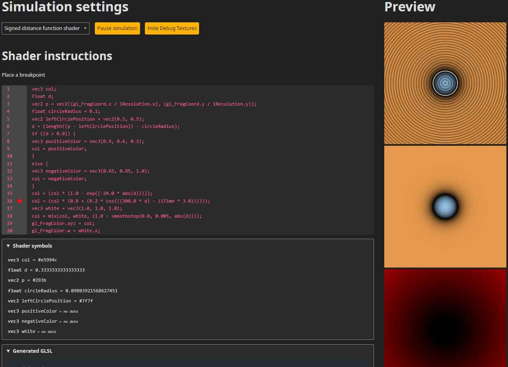

# Shader.kt



## What is this project?
### Develop Shaders In Kotlin
 - Enables shader writing in Kotlin.
 - Gather runtime information from shaders without programmer intervention

```kotlin
class VertexColorFragmentShader : DebuggableShader() {
    private val outCol by varying(::Vec3)

    init {
        val color by vec4(outCol, 1.0f)
        gl_FragColor = color
    }
}
```

### Shader Debugging Runtime
 - Provides a runtime environment that evaluates shaders and displays the gathered data.
 - Enables the developer to place breakpoints in the code and see the values of the variables.

For generating GLSL code from Kotlin there is already a [library](https://github.com/dananas/kotlin-glsl). This project is a fork of that, the code generator has been modified to accommodate features for debugging at runtime.

## User interface
The user interface is a React web application written in Kotlin, displaying the generated code and running the simulation created by the user with the shaders. Evaluation is done using WebGL.

## How to run

After you cloned the repository and opened a terminal in the root directory of the project, run the application with the following command on Windows:
```powershell
./gradlew.bat clientRun
```

or on Linux/MacOS:
```shell
./gradlew clientRun
```