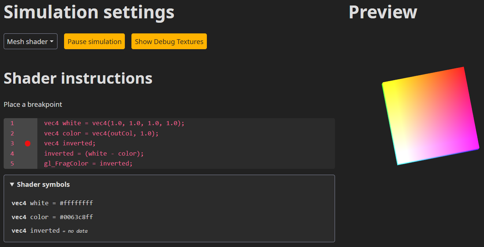
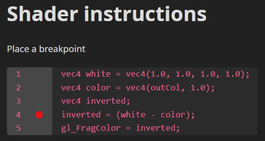
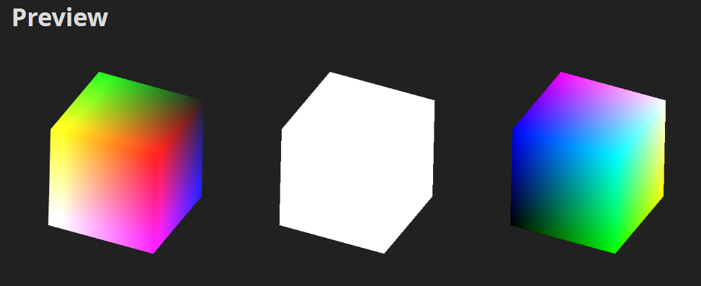
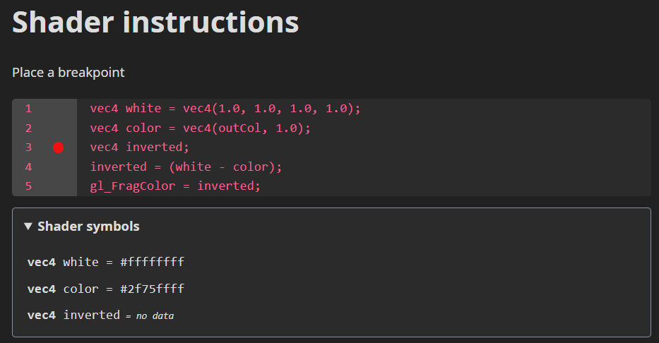

# Shaderek írása Kotlinban
### Shader kód debuggolása kódgenerálás segítségével
#### Készítette: Horváth István
#### Konzulens: Szécsi László
#### A projekt GitHub repositoryja: [https://github.com/Isti01/shader.kt](https://github.com/Isti01/shader.kt)

<div style="page-break-after: always;"></div>

## Bevezetés

A grafikai célokra kifejlesztett hardverek az idő előrehaladtával egyre több funkcionalitással rendelkeznek. Egy fontos lépés történelmükben, amikor a grafikus szerelőszalag programozható lett, tehát, a képszintézis bizonyos állomásain a programozó szabhatja meg, hogy a grafikus kártya milyen műveleteket hajtson végre egy adott primitívvel, vagy milyen színt határozzon meg egy pixelnek, amit a kirajzolandó geometria lefed. Az ilyen programokat shadereknek hívjuk.

Igaz, óriási hatalmat ad a grafikusok kezébe, valójában a GPU-ra írt programok nagyon limitáltak a megszokott CPU-n futókhoz képest. A megoldandó probléma és a rendelkezésre álló építőblokkok is eltérőek a megszokottnál, ezért egyedi nyelvek alakultak ki a shaderek írására, mint például a GLSL, HLSL vagy Slang.

A shaderek a grafikus kártyán futnak és a mai grafikai driverek limitált információt nyújtanak arról, hogy mi történik azok futása közben. Munkámban egy olyan futtató környezetet készítek, mely kódgenerálás segítségével lehetővé teszi azt, hogy nyomonkövessük a shaderben zajló számításokat.

Célom az is, hogy a shaderek írását egy könnyebben használható és megközelíthető nyelvben, a Kotlinban írjuk.
<div style="page-break-after: always;"></div>

## A projekt céljai és a kiindulópont

#### Shaderek készítése
 - Szeretnénk a Shaderek írását lehetővé tenni a Kotlin nyelvben
 - Lehetővé tenni köztes számítások kinyerését programozói beavatkozás nélkül

#### Shaderek debuggolása futásidőben
- Egy futtató környezetet biztosítani ami elvégzi a shaderek kiértékelését és az adatok megjelenítését.
- Breakpointok elhelyezése a kódban és a változók értékeinek megjelenítése

Kotlinból GLSL kód generálására már [létezik egy könyvtár](https://github.com/dananas/kotlin-glsl) munkámban számos módosítást és bővítést végeztem el rajta, hogy kinyerhessük az elérhető változók nevét és típusát, valamint a kódgenerálást is jelentősen ki kellett bővíteni új funkcionalitással ahhoz, hogy a breakpointokat támogassa.
<div style="page-break-after: always;"></div>

## Információ kinyerése shaderekből

A projektem jelenleg csak fragment shadereket képes debuggolni, mivel itt rendelkezésre áll az a lehetőség, hogy az eredményeinket kiírjuk a céltextúrába a megjelenítendő szín helyett.

#### Fragment shaderek debuggolása
A fragment shaderek különlegesek, mert az általuk írt kimenet maga a rajzolási parancs kimenete. Ebből következik az, hogy egyszerűen kinyerhetjük egy változó értékét, ha nem a képernyő framebufferébe írunk, hanem egy általunk előállítottba, melynek tartalmát a nem jelenítjük meg a képernyőn, hanem egy változó értékeként prezentáljuk a felhasználó elé.

#### Debuggolható kód generálása
A cél az, hogy a felhasználónak olyan élményt nyújtsunk mintha breakpointokat helyezhetne le a kódba és megnézhetné, hogy a változók értéke minek felel meg. Maga a kinyerés módja nem számít, amíg ez a felhasználót nem akadályozza.

Implementációmban a kódgenerátor rendelkezik a breakpoint fogalmával és képes olyan kódot előállítani, amivel egy adott pozíción a programban kiírhatjuk egy adott változónak az értékét.

#### Futtatókörnyezet biztosítása
A kódgenerátor mellé kell egy környezet is, mely rendelkezik azzal az információval, hogy a shadereinkbe parancsra debug kód generálható.

Felhasználói bemenetre el kell végeznie a shaderek debug verzióinak előállítását és azok lefuttatását, majd az eredmények megjelenítését a képernyőn.
<div style="page-break-after: always;"></div>

## A kódgenerátor működése

A kiindulásként használt könyvtár két fő módosítást igényelt.
 - Elérhetővé kellett tenni a shaderben szereplő változókat nevükkel és típusukkal.
 - Módosíthatóvá kellett tenni a generált kimenetet, azaz módosíthatóvá tenni az előállítás folyamatát.

#### Változóadatok összegyűjtése
A könyvtár a kód lefuttatásával állította elő a szükséges információt a shader szerkezetéről. A változók nevét reflection segítségével határozza meg, így a generált kódban is ugyanazok a nevek fordulnak elő, mint a programozó által megírt kódban. A változók reprezentálására használt osztályt kibővítettem ezen információk tárolására szükséges változókkal és logikával, majd a shader generálásáért felelős osztályba elhelyeztem egy listát, amiből lekérhetőek az adott shaderben szereplő változók adata.

#### A generált kimenet módosítása
A könyvtárat kibővítettem a breakpointok fogalmával. Mely jelen esetben csak annyit jelent, hogy a generátor által előállított utasítások alapján új utasításokat hoz létre. 
```kotlin
interface Breakpoint {
    fun emitInstructions(programInstructions: List<Instruction>): Iterable<Instruction>
}
```

A generátornak szüksége pontosan egy breakpointra kód előállításához, ha nem szeretnénk módosítani a kimeneten, akkor használjuk az *UnsetBreakpointot*, mely visszaadja módosítás nélkül az utasítások listáját
```kotlin
object UnsetBreakpoint : Breakpoint {
    override fun emitInstructions(programInstructions: List<Instruction>): Iterable<Instruction> = programInstructions
}
```
<div style="page-break-after: always;"></div>

A *FramebufferOutputBreakpoint* osztály felelős egy változó értékének kiírásáért egy adott sorban. Ezt úgy teszi, hogy az adott sorig minden sort módosítatlanul hagy, ezt követően minden nyitott kódblokkot bezár, majd beszúr egy utasítást, mellyel az adott változó értékét átalakítja a kimenetre kiírható típussá és értékül adja a kimeneti változónak *(gl_FragColor.)*
```kotlin
data class FramebufferOutputBreakpoint(
    val instructionIndex: Int,
    val variableToOutput: Symbol
) : Breakpoint {
    ...
}
```
<div style="page-break-after: always;"></div>

## A debugger felhasználói felülete
A felhasználói felület egy Kotlinban írt React webalkalmazás, mely megjeleníti a generált kódot és lefuttatja a felhasználó általá készített szimulációt a shaderekkel. A kiértékelés WebGL segítségével történik. A felhasználói felületen a shader utasításokba breakpointot helyezhetünk el. Az alábbi ábrán az alkalmazás egy képernyőképe látható.



A generátort utasítanunk kell arra, hogy kódot generáljuk, ezt pedig csak úgy tehetjük, ha a futtatókörnyezet is tisztában van ezzel a funkcionalitással. Az alábbi ábrán a shaderben szereplő utasításokban elhelyezett breakpoint látható a 4-es sorban a piros kör formájában.



Amikor valami módosítás történik akár az elhelyezett breakpointban, akár a szimuláció frissült, a futtatókörnyezet az összes változóra generál egy shadert, mely annak az értékét kiírja egy textúrába, ezt úgy teszi, hogy végrehajtja a szimuláció kirajzolásért felelős függvényét az adott változóhoz tartozó framebufferrel. Az alábbi ábrán a fenti változóknak megfelelő textúrákat láthatjuk.



A felhasználó az előnézetre kattintva válaszhatja ki, hogy melyik képpont kirajzolásához tartozó változók értékét szeretné megtekinteni. Ekkor, ha van olyan textúra, amely rendelkezik az adott változó értékével, akkor kiolvassa, és megjeleníti az adott pozíción szereplő értéket. Az alábbi ábrán a változók értékeinek megjelenítését láthatjuk.


<div style="page-break-after: always;"></div>

## Továbbfejlesztési lehetőségek

#### Ciklusok implementálása a kódgenerátorba
Jelenleg nem nyújt lehetőséget ciklusok kódolására a kódgenerátor. Ha ciklust használunk a Kotlin kódban, akkor a shader kódban annak egy inlineolt verzióját kapjuk meg.

#### Változók adatainak kiírása nagyobb prezicitással
A mostani implementációnak van egy olyan limitációja, hogy a használt framebufferek kis precizitású számokat tudnak csak kiírni. Erre egy lehetséges megoldás, hogy egy változó kiírását több kör alatt végezzük el úgy, hogy egy időben a változó adatainak csak bizonyos részét írjuk ki. 

#### Összes függvény implementálása a GLSL standardból
Igaz, a kódgenerátor sok függvényt támogat, nem fed le mindent, amit a GLSL nyújt. Igaz, sok munkával járna, viszont a szoftver teljességéért szükséges a teljes elérhető funkcionalitást nyújtani.

<div style="page-break-after: always;"></div>
